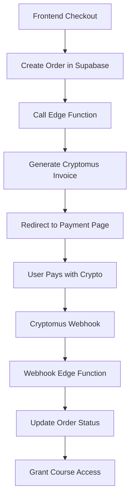

# Design Document

## Overview

The Cryptomus payment integration consists of a frontend checkout flow, Supabase edge functions for secure API communication, and webhook handling for payment verification. The system uses proper signature generation and environment variable management to ensure security and reliability.

## Architecture



## Components and Interfaces

### Frontend Components
- **Checkout.tsx**: Main payment selection and processing interface
- **cryptomus.ts**: Client-side API wrapper for edge function calls

### Backend Components
- **create-cryptomus-invoice**: Edge function for secure invoice creation
- **payment-webhook**: Edge function for processing payment notifications
- **Orders table**: Database storage for order tracking

### External Interfaces
- **Cryptomus API**: Invoice creation and payment processing
- **Cryptomus Webhooks**: Payment status notifications

## Data Models

### Order Model
```typescript
interface Order {
  id: string
  email: string
  payment_provider: 'gumroad' | 'cryptomus'
  amount: number
  status: 'pending' | 'completed' | 'failed'
  payment_id?: string
  metadata: {
    order_id: string
    cryptomus_invoice?: CryptomusInvoice
    webhook_data?: any
    updated_at?: string
  }
  created_at: string
  updated_at: string
}
```

### Cryptomus Invoice Model
```typescript
interface CryptomusInvoice {
  uuid: string
  order_id: string
  amount: string
  currency: string
  url: string
  status: string
}
```

## Configuration Management

### Environment Variables
- **Frontend (.env)**:
  - `VITE_SUPABASE_URL`: Single, consistent Supabase project URL
  - `VITE_SUPABASE_ANON_KEY`: Public Supabase key

- **Supabase Secrets**:
  - `CRYPTOMUS_MERCHANT_ID`: Merchant identifier from Cryptomus dashboard
  - `CRYPTOMUS_API_KEY`: API key for signature generation

### Signature Generation
The system uses MD5 hashing with the formula: `MD5(base64(JSON_data) + API_KEY)`

## Error Handling

### Frontend Error Handling
- Network failures: Graceful fallback with user-friendly messages
- Invalid responses: Clear error display with retry options
- Missing credentials: Informative setup instructions

### Backend Error Handling
- Missing environment variables: Detailed validation with setup guidance
- API failures: Comprehensive logging with error propagation
- Webhook verification: Security-focused validation with audit trails

### Fallback Mechanisms
- If Cryptomus fails, users can still use Gumroad
- Order creation happens before payment to ensure tracking
- Webhook failures don't break the payment flow

## Testing Strategy

### Unit Tests
- Signature generation validation
- Environment variable validation
- Order creation and updates
- Error handling scenarios

### Integration Tests
- End-to-end payment flow
- Webhook processing
- Database operations
- API communication

### Manual Testing
- Payment flow with test credentials
- Webhook simulation
- Error scenario validation
- Cross-browser compatibility

## Security Considerations

### Credential Management
- All sensitive data stored in Supabase secrets
- No hardcoded credentials in source code
- Proper environment separation

### Webhook Security
- Signature verification for all incoming webhooks
- Request validation and sanitization
- Audit logging for security events

### Data Protection
- Minimal PII storage
- Secure transmission (HTTPS only)
- Proper error message sanitization